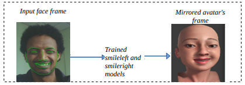

# Realtime Facial Emotion Mirroring
Realtime facial emotion mirroring from a 2D webcam human video to a 3D facial avatar model. It uses a ROS based communication interface between the Dlib library (used here for realtime face emotion capture) and blender based 3D face avatar animation API.
### Sample screenshot of realtime facial smile mirroring

## Install and run
Open a new terminal and execute the following commands one by one.

`git clone https://github.com/hansonrobotics/Realtime_mirroring.git` # Get the necessary ros packages and source codes
```
cd Realtime_mirroring
catkin_make
cd src
pip3 install -t ../devel/lib/python2.7/dist-packages/ ./blender_api_msgs
cd ..
source devel/setup.bash

```
In the same terminal or another run the command below to launch "dlib_puppeteering" package.
```
roslaunch dlib_puppeteering dlib_camera.launch 
```
To start/see the mapping/link between dlib_puppeteering and blender_api, Open a new terminal and execute the commands below.
```
cd ~/Realtime_mirroring/src/blender_api
blender -y Sophia.blend -P autostart.py
```
NOTE: the following changes has been made to some parameters in ../blender_api/rigControl/commands.py

16 - Face shapekeys controlled by PAU

`self.pauAnimationMode = 16`

If 1 current shapekeys are controlled directly by PAU, otherwise by default drivers

`self.shapekeysControl = 1`
## To Exit,
```
close blender GUI.
quit/stop dlib_puppeteering with CTRL+C.
```
## Error and fix:
Unable to open /home/..Realtime_mirroring/src/dlib_puppeteering/src/shape_predictor_68_face_landmarks.dat for reading.
[dlib_puppeteering_node-3] process has died [pid 5800, exit code -6, cmd /home/..Realtime_mirroring/devel/lib/dlib_puppeteering/dlib_puppeteering_node __name:=dlib_puppeteering_node __log:=/home/../.ros/log/746c1e46-20b2-11e6-96af-94de80604b3b/dlib_puppeteering_node-3.log].
log file: /home/../.ros/log/746c1e46-20b2-11e6-96af-94de80604b3b/dlib_puppeteering_node-3*.log

you have to download and change the location of [shape_predictor_68_face_landmarks.dat](dlib.net/files/shape_predictor_68_face_landmarks.dat.bz2)

#Below is an online official github link to download the dlib model: 
`https://github.com/davisking/dlib-models`


